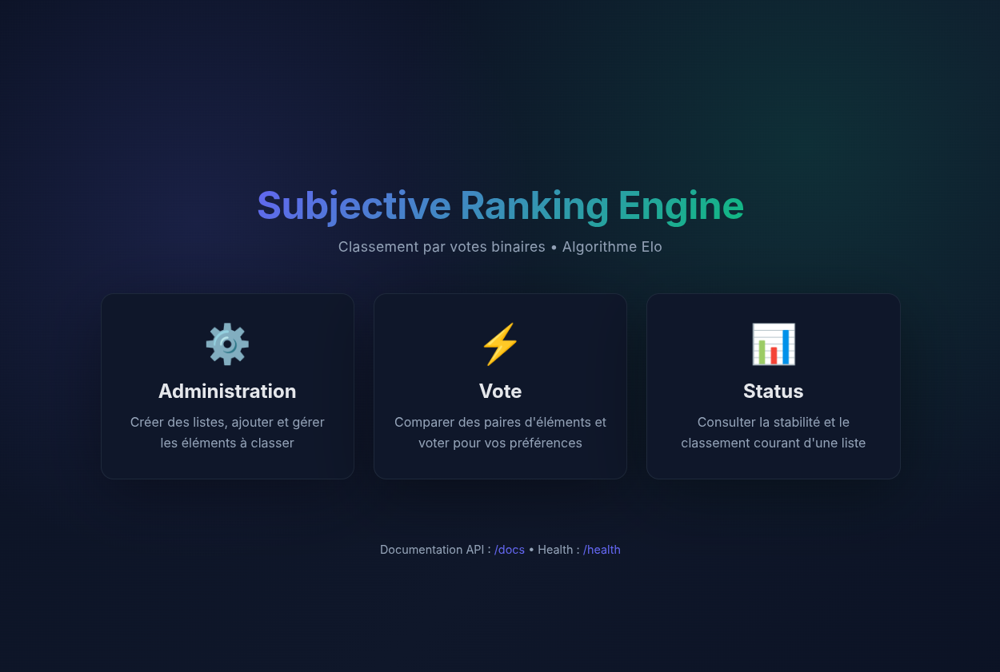
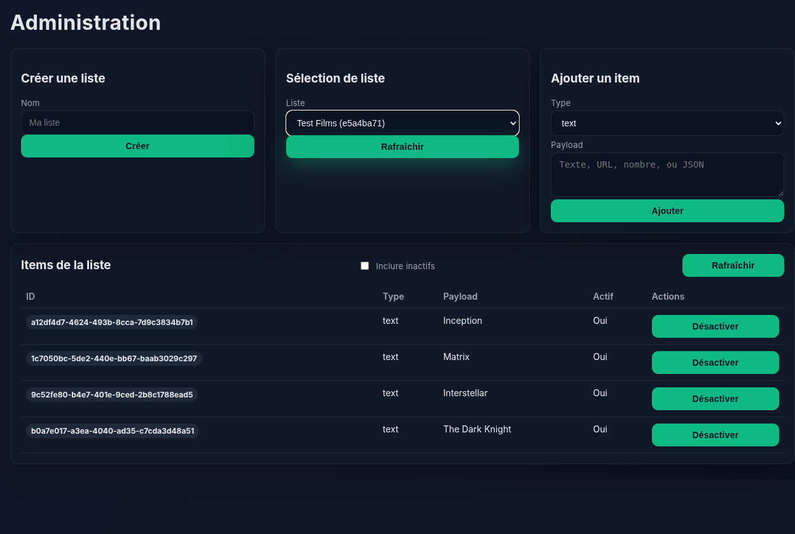
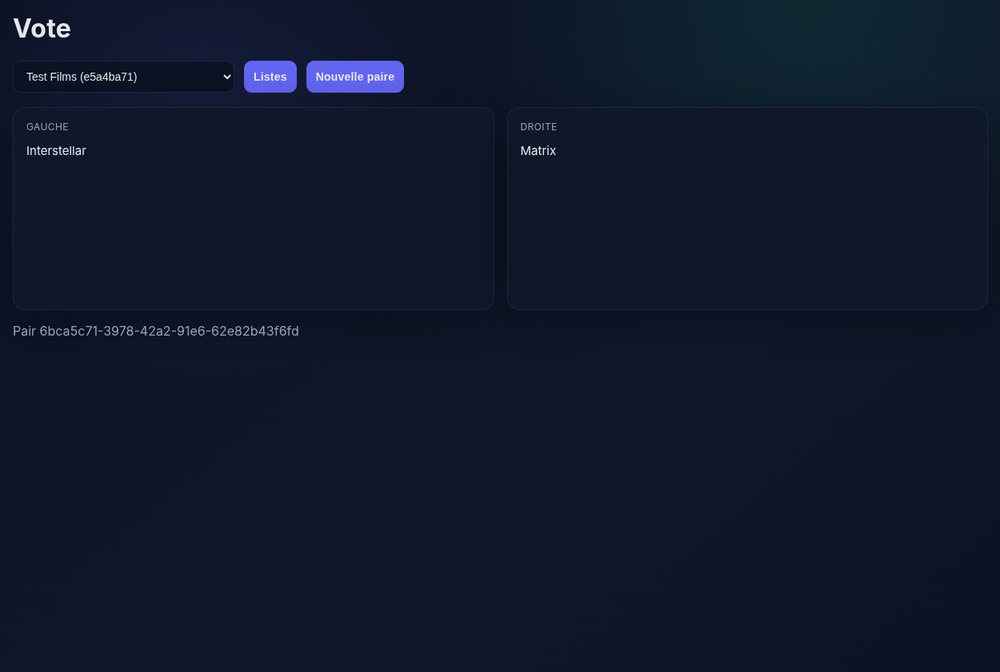
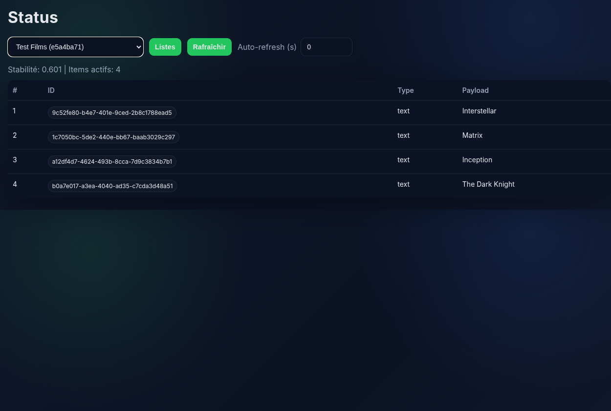

# Subjective Ranking Engine



## 📖 À propos

**Subjective Ranking Engine** est un système de classement collaboratif basé sur des comparaisons par paires. Au lieu de demander à vos utilisateurs de noter chaque élément sur une échelle arbitraire (1-5 étoiles, 1-10, etc.), ce système leur présente deux options à la fois et leur demande simplement : **"Laquelle préférez-vous ?"**

### Pourquoi c'est utile ?

Les comparaisons binaires sont plus **faciles** et **cohérentes** pour les humains que les notes absolues. Choisir entre deux films est naturel, mais donner une note objective sur 10 à un film isolé est difficile et source de biais. Ce système exploite cette observation pour construire un classement robuste et consensuel.

### Cas d'usage

- 🎬 **Classement de films, livres, musiques** : Découvrez les véritables préférences de votre communauté
- 🍔 **Choix de restaurant, plats** : Aidez vos clients à trouver le meilleur burger de la ville
- 🎨 **Design, logos, prototypes** : Laissez votre équipe voter pour le meilleur design
- 📝 **Priorisation de features** : Classez les demandes produit selon les votes utilisateurs
- 🏆 **Compétitions, concours** : Organisez des tournois de comparaison sur n'importe quel sujet

### Comment ça fonctionne ?

1. **Création** : Ajoutez vos éléments (texte, images, JSON, nombres)
2. **Vote** : Les utilisateurs comparent des paires et choisissent leur favori
3. **Classement** : L'algorithme Elo met à jour en temps réel le classement global
4. **Stabilité** : Une métrique indique quand le consensus est atteint (>90% de certitude)

En seulement **20-30 comparaisons**, vous obtenez un classement fiable pour une liste de 10 éléments. L'algorithme sélectionne intelligemment les paires les plus informatives pour accélérer la convergence.

## ✨ Fonctionnalités

- **Algorithme Elo** pour le classement subjectif avec convergence rapide
- **Sélection intelligente de paires** : favorise les items peu comparés et Elo proches
- **Soft delete** : désactivation des items sans perte d'historique
- **Stabilité** : métrique 0..1 calculée sur les probabilités Elo adjacentes
- **3 interfaces** : admin, vote, status
- **API REST** complète avec documentation OpenAPI

## 🚀 Démarrage rapide

### Option 1 : Script shell
```bash
./run.sh
```

### Option 2 : Makefile
```bash
make install  # Première fois
make dev      # Lancer en mode dev
make test     # Exécuter les tests
```

### Option 3 : Manuel
```bash
python3 -m venv venv
source venv/bin/activate
pip install -r requirements.txt
uvicorn app:app --reload
```

Puis ouvrir http://localhost:8000

## 📱 Interfaces utilisateur

Le système propose trois interfaces web complètes pour gérer vos classements :

### 🎛️ Administration


L'interface d'**administration** permet de créer et gérer vos listes de classement. Vous pouvez :
- Créer plusieurs listes indépendantes (films, restaurants, designs, etc.)
- Ajouter des éléments de différents types : texte simple, nombres, URLs d'images, ou objets JSON complexes
- Modifier ou désactiver des éléments à tout moment (soft delete)
- Réactiver des éléments précédemment supprimés
- Visualiser tous vos éléments avec un rendu adapté (miniatures pour les images, formatage JSON)

### ⚡ Vote


L'interface de **vote** est au cœur du système. Elle présente de manière claire et intuitive :
- Deux éléments côte à côte pour une comparaison directe
- Un clic sur la carte de votre choix enregistre le vote
- Chargement automatique de la paire suivante après chaque vote
- Possibilité de passer une paire (skip) sans voter
- Design épuré pour se concentrer sur la décision

L'algorithme sélectionne intelligemment les paires à présenter : il privilégie les éléments peu comparés et ceux dont le classement est incertain (Elo proches), maximisant ainsi l'information apportée par chaque vote.

### 📊 Classement et stabilité


L'interface de **status** affiche en temps réel :
- Le **score de stabilité** (0 à 1) : indique le niveau de consensus atteint
  - < 0.6 : classement instable, continuez à voter
  - 0.6-0.8 : convergence en cours
  - 0.8-0.9 : classement assez fiable
  - \> 0.9 : consensus fort, classement très stable
- Le **classement complet** trié par score Elo décroissant
- Option d'**auto-refresh** pour suivre l'évolution en direct lors de sessions de vote collaboratif

Cette vue permet de savoir instantanément si vous avez besoin de plus de votes ou si le classement est suffisamment robuste pour prendre des décisions.

---

## 🔧 API (résumé)

### Listes
- `POST /lists` — créer une liste `{"name": "..."}`
- `GET /lists` — lister toutes les listes
- `GET /lists/{list_id}` — détails d'une liste

### Items
- `POST /lists/{list_id}/items` — créer un item `{"type": "text|number|image|json", "payload": ...}`
- `GET /lists/{list_id}/items?include_inactive=bool` — lister les items
- `PATCH /lists/{list_id}/items/{item_id}` — modifier type/payload/active
- `DELETE /lists/{list_id}/items/{item_id}` — soft delete (active=false)

### Vote
- `GET /lists/{list_id}/pair` — obtenir une paire `{pair_id, left, right}`
- `POST /lists/{list_id}/vote` — voter `{"pair_id": "...", "winner": "left|right"}`
  - Ignore automatiquement si pair déjà répondue ou item inactif

### Status
- `GET /lists/{list_id}/status` — `{stability: 0..1, sorted_items: [...]}`

## 🧪 Tests

```bash
make test
# ou
pytest -v
```

Couvre :
- Calcul Elo et probabilités
- Sélection de paires (2 items distincts actifs)
- Flow complet : création liste → ajout items → pair → vote → status
- Soft delete puis vote sur ancienne paire → ignoré sans crash

## 🎯 Algorithme (MVP)

### Sélection de paire
1. Pool : items actifs les moins joués (limite 200)
2. Focus : un item parmi les plus bas en `games` (limite 30)
3. Adversaire : minimise `|elo_focus - elo_opponent|` dans le pool

### Mise à jour Elo
- Classique avec K=24 par défaut
- `p(A gagne) = 1 / (1 + 10^(-(eloA - eloB)/400))`
- `eloA' = eloA + K * (score - p)`

### Stabilité
- Trier items actifs par Elo décroissant
- Pour chaque paire adjacente (i, i+1), calculer `p(i bat i+1)`
- Stabilité = moyenne de ces probabilités
- Interprétation : >0.9 = très stable, ~0.5 = instable

## 🗂️ Structure

```
.
├── app.py                 # API FastAPI + Elo + persistence SQLite
├── static/
│   ├── index.html         # Page d'accueil
│   ├── admin.html         # Interface admin
│   ├── vote.html          # Interface vote
│   └── status.html        # Interface status
├── tests/
│   └── test_app.py        # Tests unitaires + intégration
├── requirements.txt
├── Makefile
├── run.sh                 # Script de lancement rapide
└── README.md
```

## 📊 Configuration

- **DB_PATH** : chemin SQLite (défaut: `data.db`)
- **ELO_K** : facteur K Elo (défaut: 24)
- **POOL_SIZE** : taille du pool de sélection (défaut: 200)
- **FOCUS_SIZE** : taille du sous-pool focus (défaut: 30)

## 📝 Notes

- Base SQLite par défaut `data.db` (configurable via env `DB_PATH`)
- Soft delete uniquement : items désactivés ne disparaissent jamais de la DB
- Pairs non réservées : plusieurs utilisateurs peuvent voter en parallèle
- Évolutivité testée jusqu'à 50k items (cible 100k)

## 🔮 Extensions futures (hors MVP)

- Modèles avancés : Bradley-Terry, TrueSkill
- Active learning pour sélection optimale de paires
- Auth légère + rate limiting
- Export CSV/JSON
- Analytics et historique détaillé

---

## 👤 Auteur

**David LOUISE**

## 📄 Licence

MIT
